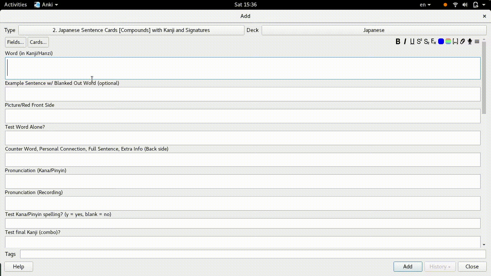

# Anki smart copy



Smart copy allows you to intelligently copy contents of one note to another. It's highly flexible and configurable.

Supports Anki>=2.1.20.

## Why?

I used a note type (model) that's most convenient for me to use, but it had no content. I had to create notes and fill them with content. Other decks out there have the content I need, but I had to copy the content manually for every new note.

That's why I created smart copy: To automatically copy fields from another note, and allow some manipulation on the copied text to save me even more manual work.

## Getting started

First, you need to configure the name of the field that the plugin identifies as the subject for searching. When the field loses focus, it will start searching other notes and copy whatever it can find, based on the configuration described below. There are currently two kinds of searches:
A *whole text search*, and *per character search*.

### Whole text search

Searches the whole text of the subject field in other notes.

#### Examples

```json
{
  "blankOutTextRegex": null,
  "blankOutWordAfterCopy": false,
  "copyOnlyIfEmpty": false,
  "destinationField": "Pronunciation (Recording)",
  "noteType": "Japanese v2-62274-e76b4",
  "sourceField": "vocab-audio",
  "textToRemoveRegex": null
}
```

Copies the text of the field named `vocab-audio` from a note of type `Japanese v2-62274-e76b4`, to the field named `Pronunciation (Recording)` of the currently edited note.


```json
{
  "blankOutTextRegex": "<b>(.*?)</b>",
  "blankOutWordAfterCopy": true,
  "copyOnlyIfEmpty": false,
  "destinationField": "Example Sentence w/ Blanked Out Word (optional)",
  "noteType": "Japanese v2-62274-e76b4",
  "sourceField": "sentence",
  "textToRemoveRegex": "\\[.*?\\]"
}
```

Copies the text of the field named `sentence` from a note of type `Japanese v2-62274-e76b4`, to the field named `Example Sentence w/ Blanked Out Word (optional)` of the currently edited note. The first text that appears inside `<b>` brackets (i.e. bold) will be replaced with `_` in the destination field. In addition, all the text inside square brackets (`[]`), including the square brackets themselves, will be removed from the destination field.

#### Parameters

- `noteType`: Type of the note in which to search the text that is found in `subjectField`.
- `sourceField`: Name of the field from which to copy the contents.
- `destinationField`: Name of the field in the currently edited note to copy the contents into.
- `blankOutWordAfterCopy`: If the text in the subject field appears in the text of `fieldToCopyFrom` and this flag is set to `true`, then this sub-text will be replaced with `_` in `fieldToCopyTo`. See also `blankOutRegex`.
- `copyOnlyIfEmpty`: If this is set to `true`, copies the text only if `destinationField` is empty.
- `textToRemoveRegex`: Removes all the instances that match this regular expression from the text in `sourceField` before copying it to `destinationField`. Defaults to not removing any text.
- `blankOutTextRegex`: Instead of blanking out the exact text in `subjectField`, blank out the first match of this regex in the text of `destinationField` (That is, the match inside the parenthesis). `blankOutWordAfterCopy` must be set to `true` for this to work. Defaults to not manipulating the text.

### Per character search

Searches per-character of the subject field in other notes (Each character can be found in a different note).

#### Examples

```json
{
  "copyOnlyIfEmpty": false,
  "destinationFields": [
    "Info Kanji 1",
    "Info Kanji 2",
    "Info Kanji 3",
    "Info Kanji 4"
  ],
  "filterCharacters": "FILTER_KANJI",
  "noteType": "KanjiDamage",
  "sourceField": "Components"
}
```

Searches the text in the subject field on a per-character basis, searching only Kanji characters. For each found character in a note, copies the text of `sourceField` in the note to the corresponding field in `destinationFields`. That is, the text for the first character is copied to `Info Kanji 1`, the text for the second is copied to `Info Kanji 2`, etc.

#### Parameters

- `noteType`: Type of the note to copy the text from. If a note with this type wasn't found, no copy will occur.
- `sourceField`: Name of the field to copy the text from. If a field with this name wasn't found, no copy will occur.
- `filterCharacters`: If specified, filters characters to search for. Currently, supports only `FILTER_KANJI`.
- `destinationFields`: A list of field names in the currently edited note. Each field is a destination for a character that was searched for (i.e. a character filtered by `filter_characters`). If the number of fields here is shorter than the list of characters to search for, only the characters up to the number of fields will be copied.
- `copyOnlyIfEmpty`: If this is set to `true`, copies the text only if `destinationField` is empty.

## Real world example

This is the configuration I use for myself:

```json
{
  "perCharacterSearchConfigurations": [
    {
      "copyOnlyIfEmpty": false,
      "destinationFields": [
        "Extra Info Kanji 1 (component parts/mnemonics for meaning)",
        "Extra Info Kanji 2 (component parts/mnemonics for meaning)",
        "Extra Info Kanji 3 (component parts/mnemonics for meaning)",
        "Extra Info Kanji 4 (component parts/mnemonics for meaning)"
      ],
      "filterCharacters": "FILTER_KANJI",
      "noteType": "KanjiDamage",
      "sourceField": "Components"
    }
  ],
  "subjectField": "Word (in Kanji/Hanzi)",
  "wholeTextSearchConfigurations": [
    {
      "blankOutTextRegex": null,
      "blankOutWordAfterCopy": false,
      "copyOnlyIfEmpty": false,
      "destinationField": "Counter Word, Personal Connection, Full Sentence, Extra Info (Back side)",
      "noteType": "Japanese v2-62274-e76b4",
      "sourceField": "sentence",
      "textToRemoveRegex": "\\[.*?\\]"
    },
    {
      "blankOutTextRegex": null,
      "blankOutWordAfterCopy": false,
      "copyOnlyIfEmpty": false,
      "destinationField": "Pronunciation (Recording)",
      "noteType": "Japanese v2-62274-e76b4",
      "sourceField": "vocab-audio",
      "textToRemoveRegex": null
    },
    {
      "blankOutTextRegex": null,
      "blankOutWordAfterCopy": false,
      "copyOnlyIfEmpty": false,
      "destinationField": "Pronunciation (Recording)",
      "noteType": "Japanese v2-62274-e76b4",
      "sourceField": "sentence-audio",
      "textToRemoveRegex": null
    },
    {
      "blankOutTextRegex": null,
      "blankOutWordAfterCopy": false,
      "copyOnlyIfEmpty": true,
      "destinationField": "Picture/Red Front Side",
      "noteType": "Japanese v2-62274-e76b4",
      "sourceField": "image",
      "textToRemoveRegex": null
    },
    {
      "blankOutTextRegex": "<b>\\s*?(\\S*?)<\/b>",
      "blankOutWordAfterCopy": true,
      "copyOnlyIfEmpty": false,
      "destinationField": "Example Sentence w/ Blanked Out Word (optional)",
      "noteType": "Japanese v2-62274-e76b4",
      "sourceField": "sentence",
      "textToRemoveRegex": "\\[.*?\\]"
    }
  ]
}
```

I use the Japanese Model Deck that can be downloaded from [Fluent Forever](https://blog.fluent-forever.com/kanjisignatures/), with slight modifications. When I add a note, I type the word in the field named `Word (in Kanji/Hanzi)`. The above configuration automatically copies fields from two decks: [Core 10k Further Optimized](https://archive.org/details/Core2k6k10KFurtherOptimizedPICSOUND), and from [KanjiDamage deck](https://ankiweb.net/shared/info/748570187), exactly like shown in the screenshot.
